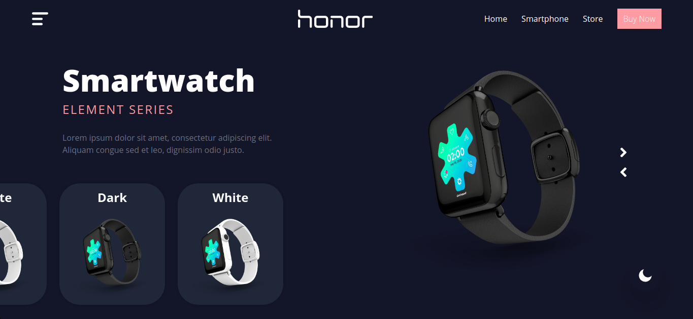

<p align="center">
  <a href="https://github.com/joonacode/react-smartwatch/">
    
  </a>

  <h1 align="center">React Smartwatch</h3>
Practice slicing web design into a website page with Tailwindcss. Design by <a href="https://dribbble.com/m4st3rmiau">Mauricio Lopez</a>
<br/ >
  <p align="center">
    <br />
    <a href="https://joonacode.github.io/react-smartwatch/">View Demo</a>
  </p>
</p>

### Built With

* [ReactJS](https://reactjs.org)
* [TailwindCSS](https://tailwindcss.com)
* [React Slick](https://react-slick.neostack.com)


<!-- GETTING STARTED -->
## Getting Started

### Installation

1. Clone the repo
```sh
git clone https://github.com/joonacode/react-smartwatch.git
```
2. Install NPM packages
```sh
npm install or yarn install
```
3. Run project
```sh
npm run start or yarn start
```

<!-- CONTRIBUTING -->
## Contributing

Contributions are what make the open source community such an amazing place to be learn, inspire, and create. Any contributions you make are **greatly appreciated**.

1. Fork the Project
2. Create your Feature Branch (`git checkout -b feature/AmazingFeature`)
3. Commit your Changes (`git commit -m 'Add some AmazingFeature'`)
4. Push to the Branch (`git push origin feature/AmazingFeature`)
5. Open a Pull Request


<!-- CONTACT -->
## Contact

joonacode@gmail.com

Project Link: [https://github.com/joonacode/react-smartwatch](https://github.com/joonacode/react-smartwatch)


<!-- ACKNOWLEDGEMENTS -->
## Acknowledgements
* [React toggle dark mode](https://www.npmjs.com/package/react-toggle-dark-mode)
* [React slick](https://react-slick.neostack.com)
